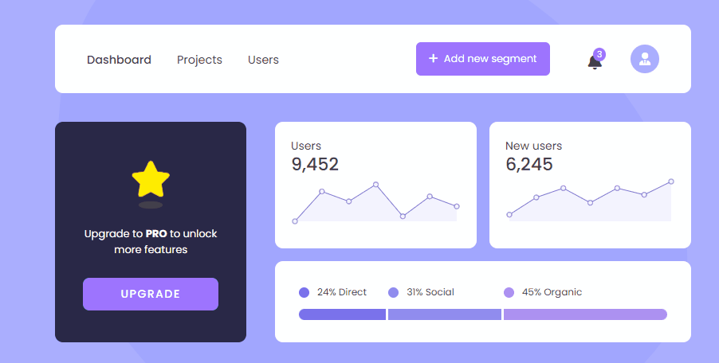
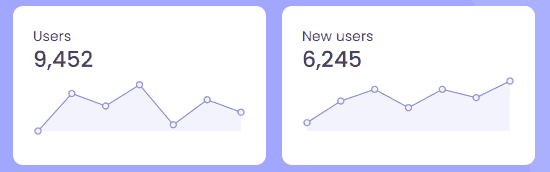

<h1 align="center">Dashboard UI</h1> 

  

  <h2><a href="https://veraenders.github.io/dashboard-ui/">Live</a>
   |  
  <a href="https://github.com/VeraEnders/dashboard-ui">Code</a></h2>
  
Challenge is provided by <a href="https://icodethis.com/">iCodeThis</a>.
 

## About the project
The Dashboard UI Component is a user-friendly and informative dashboard that presents key statistics and visualizations, offering valuable insights and analytics regarding user activity and growth.

## Built with
- HTML5 / CSS
- Mobile-first workflow
- [Chart.js](https://www.chartjs.org/) is an free JS library for data visualization

## Features

### Line Charts
The Dashboard UI Component incorporates line charts generated using the Chart.js library. These charts visually represent data trends, allowing to analyze user activity and new user acquisition over time.

  

## Author
GitHub - [VeraEnders](https://github.com/VeraEnders)